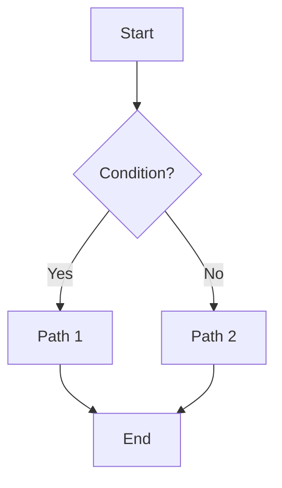

# Writing pages in Markdown and MDX (Docusaurus)

Use these examples as templates when creating docs.

## Basic Markdown page
```md
---
# Page metadata (optional but recommended)
title: "Getting Started"
description: "Quick intro for new contributors"
sidebar_position: 1
sidebar_label: "Overview"
---

# Getting Started

Write your content here. Keep paragraphs short and use headings to organize.
```

## Admonitions (callouts)
```md
:::tip Quick tip
Use `--help` with any command to see options.
:::

:::info Note
This works in Markdown and MDX files.
:::

:::warning Be careful
Production buckets are protected. Use the correct profile.
:::

:::danger Breaking change
`bucket-name` was renamed to `bucket` in v3.0.0.
:::
```

## Collapsible details
```md
<details>
<summary>Advanced options</summary>

- `--dry-run`: validate without uploading
- `--verbose`: extra logs

</details>
```

## Code blocks
```bash title="Deploy snapshot" showLineNumbers
# highlight-next-line
python s3-cli.py deploy-snapshot \
  --folder-path ./website/build \
  --bucket my-bucket \
  --prefix /docs/s3-cli/ \
  --target-server AWS_S3
```

```yaml title="maintenance.yaml"
# highlight-start
maintenance:
  enabled: true
  message: "Scheduled maintenance"
# highlight-end
```

## Mermaid diagrams


## MDX: using React components
Save as `.mdx` when you need components.

```mdx title="drawio-example.mdx"
import Drawio from '@theme/Drawio';
import diagram from '!!raw-loader!./my-diagram.drawio';

# Architecture

<Drawio content={diagram} />
```

### Tabs (optional, MDX)
```mdx
import Tabs from '@theme/Tabs';
import TabItem from '@theme/TabItem';

<Tabs>
  <TabItem value="bash" label="Bash">
{`\n\n\u0060\u0060\u0060bash\npython s3-cli.py --help\n\u0060\u0060\u0060\n\n`}
  </TabItem>
  <TabItem value="powershell" label="PowerShell">
{`\n\n\u0060\u0060\u0060powershell\npython s3-cli.py --help\n\u0060\u0060\u0060\n\n`}
  </TabItem>
</Tabs>
```

### Copyable raw examples

```md title="Admonitions raw Markdown" showLineNumbers
:::tip Quick tip
Use `--help` with any command to see options.
:::

:::info Note
This works in Markdown and MDX files.
:::

:::warning Be careful
Production buckets are protected. Use the correct profile.
:::

:::danger Breaking change
`bucket-name` was renamed to `bucket` in v3.0.0.
:::
```

```md title="Details raw Markdown" showLineNumbers
<details>
<summary>Advanced options</summary>

- `--dry-run`: validate without uploading
- `--verbose`: extra logs

</details>
```

## Links and images
```md
See the [Commands](../command/deploy-snapshot.md) section.


```

Tips:
- Place shared images in `website/static/img` to reference with `/img/...`.
- Prefer relative links between docs (they’re validated in CI).
