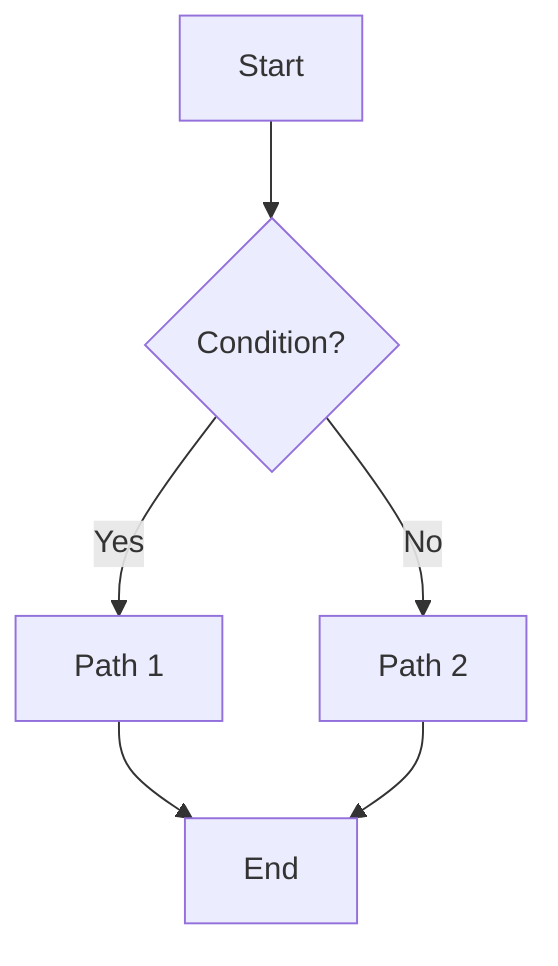
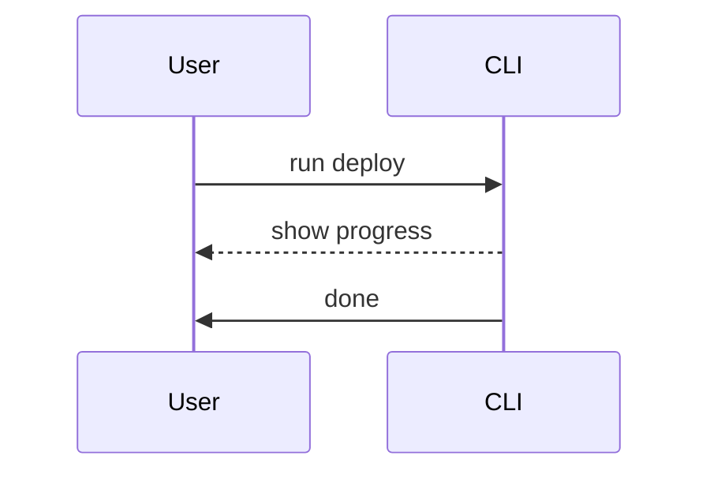

# Mermaid diagrams: how to use

Mermaid lets you create sequence diagrams, flowcharts, and more with simple text syntax.

## Basics
- Use fenced code blocks with the language set to `mermaid`.
- The theme is enabled globally; no extra imports needed.


Raw Markdown you can copy:

{`\u0060\u0060\u0060mermaid
flowchart TD
  A[Start] --> B{Condition?}
  B -- Yes --> C[Path 1]
  B -- No --> D[Path 2]
  C --> E[End]
  D --> E[End]
\u0060\u0060\u0060`}

### Flowchart example


### Sequence diagram example


### Tips
- Keep nodes short and readable.
- Use comments `%` inside Mermaid blocks for notes.
- Large diagrams: break into sections or separate files.

## Styling
You can override Mermaid theme variables via CSS if needed. For example, to tweak line colour in dark mode:

```css
html[data-theme='dark'] .mermaid svg {
  --mermaid-themeVariables-lineColor: #9ca3af;
}
```

## Troubleshooting
- If a diagram doesn’t render, check that the code fence starts with ```mermaid.
- Avoid HTML tags inside Mermaid code blocks.
